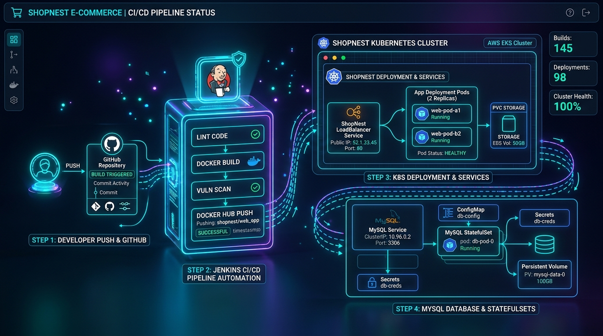

# 🛍️ ShopNest — AWS E-Commerce Platform

[](LICENSE)
[](https://www.php.net/)
[](https://www.docker.com/)
[](https://www.mysql.com/)
[](k8s/)
[](https://aws.amazon.com/cli/)

ShopNest is a modern, responsive, and open-source PHP-based E-Commerce web application featuring a complete customer storefront, cart, checkout, order tracking, admin dashboard, and Kubernetes + Jenkins CI/CD deployment architecture on AWS EKS.

### 🔑 Default Credentials (Seed Data)

| Portal | Access URL | Username / Email | Password | Access Level |
|---|---|---|---|---|
| **Admin Panel** | `/admin/login.php` | `admin@shopnest.com` | `Admin@1234` | Full Catalog, Orders & Inventory Management |
| **Customer Portal** | `/customer/login.php` | `rahul@example.com` | `Customer@123` | Storefront Shopping & Order History |

---

## 🎨 3D Architecture Diagram



---

## 📋 Required Software & Version Matrix

Below are the recommended and minimum supported versions along with official direct download links for the technologies, runtimes, container engines, and DevOps tools used in ShopNest:

| Category | Software / Tool | Recommended Version | Minimum Version | Official Download Link | Purpose in ShopNest |
|---|---|---|---|---|---|
| **Cloud Provider CLI** | **AWS CLI v2** | `v2.15+` | `v2.0+` | [Download AWS CLI](https://aws.amazon.com/cli/) | Connecting kubectl to AWS EKS cluster (`aws eks update-kubeconfig`) |
| **Container Engine** | **Docker Engine / Desktop** | `25.0+` / `24.0+` | `20.10+` | [Download Docker](https://www.docker.com/products/docker-desktop/) | Packaging PHP app and isolated container runtime |
| **CI/CD Server** | **Jenkins** | `2.426+` (LTS) | `2.400+` | [Download Jenkins](https://www.jenkins.io/download/) | CI/CD pipeline automation: PHP lint, image build/push, k8s rollout |
| **Cloud Native** | **Kubernetes (k8s)** | `v1.28+` / `v1.29+` | `v1.24+` | [Download Minikube/K8s](https://kubernetes.io/docs/tasks/tools/) | Container pod scaling, self-healing, and rolling updates |
| **K8s CLI** | **kubectl** | `v1.28+` | `v1.24+` | [Download kubectl](https://kubernetes.io/docs/tasks/tools/install-kubectl/) | Command-line client for managing cluster deployments |
| **Backend Runtime** | **PHP** | `8.2+` / `8.3` | `8.1+` | [Download PHP](https://www.php.net/downloads) | Core backend logic (`mysqli`, `pdo`, `mbstring`, `curl`, `gd`) |
| **Database** | **MySQL Server** | `8.0+` | `8.0.28+` | [Download MySQL](https://dev.mysql.com/downloads/mysql/) | Relational database (products, categories, orders, users) |
| **Web Server** | **Apache HTTP Server** | `2.4.57+` | `2.4+` | [Download Apache](https://httpd.apache.org/download.cgi) | Web server with `mod_rewrite` URL routing |
| **VCS** | **Git** | `2.40+` | `2.30+` | [Download Git](https://git-scm.com/downloads) | Source code versioning and repository management |

> 💡 **Quick Install via Package Managers:**
> - **Windows (Winget):** `winget install Amazon.AWSCLI Docker.DockerDesktop Git.Git Kubernetes.kubectl`
> - **macOS (Homebrew):** `brew install awscli docker kubectl git php mysql`
> - **Ubuntu / Debian (APT):** `sudo apt update && sudo apt install -y docker.io git php8.2 mysql-server`

---

## 📥 Prerequisites & Service Installation (Linux / Ubuntu 24.04 LTS)

> Use these copy-paste commands to set up your server or VM instance from scratch.

### 1. 🔧 Git

```bash
sudo apt update && sudo apt install -y git
git --version
```

### 2. 🐘 PHP 8.2 + Required Extensions

```bash
sudo apt update
sudo apt install -y software-properties-common
sudo add-apt-repository ppa:ondrej/php -y
sudo apt update

sudo apt install -y php8.2 php8.2-cli php8.2-mysql php8.2-gd php8.2-zip php8.2-mbstring php8.2-xml php8.2-curl php8.2-opcache php8.2-mysqli
php --version
```

### 3. 🐬 MySQL 8.0

```bash
sudo apt update && sudo apt install -y mysql-server
sudo systemctl start mysql && sudo systemctl enable mysql
mysql --version
```

### 4. 🌐 Apache 2.4

```bash
sudo apt update && sudo apt install -y apache2
sudo a2enmod rewrite
sudo systemctl restart apache2 && sudo systemctl enable apache2
apache2 -v
```

### 5. 🐳 Docker Engine

```bash
sudo apt update && sudo apt install -y ca-certificates curl gnupg
sudo install -m 0755 -d /etc/apt/keyrings
curl -fsSL https://download.docker.com/linux/ubuntu/gpg | sudo gpg --dearmor -o /etc/apt/keyrings/docker.gpg
sudo chmod a+r /etc/apt/keyrings/docker.gpg

echo "deb [arch=$(dpkg --print-architecture) signed-by=/etc/apt/keyrings/docker.gpg] https://download.docker.com/linux/ubuntu $(. /etc/os-release && echo "$VERSION_CODENAME") stable" | sudo tee /etc/apt/sources.list.d/docker.list > /dev/null

sudo apt update && sudo apt install -y docker-ce docker-ce-cli containerd.io docker-buildx-plugin docker-compose-plugin
sudo usermod -aG docker $USER
docker --version
```

### 6. 🏗️ Jenkins CI/CD

```bash
sudo apt update && sudo apt install -y openjdk-17-jdk
sudo install -m 0755 -d /usr/share/keyrings
curl -fsSL https://pkg.jenkins.io/debian-stable/jenkins.io-2023.key | sudo tee /usr/share/keyrings/jenkins-keyring.asc > /dev/null
echo "deb [signed-by=/usr/share/keyrings/jenkins-keyring.asc] https://pkg.jenkins.io/debian-stable binary/" | sudo tee /etc/apt/sources.list.d/jenkins.list > /dev/null

sudo apt update && sudo apt install -y jenkins
sudo usermod -aG docker jenkins
sudo systemctl restart jenkins && sudo systemctl enable jenkins
sudo cat /var/lib/jenkins/secrets/initialAdminPassword
```

### 7. ☸️ Kubernetes (`kubectl`)

```bash
sudo install -m 0755 -d /etc/apt/keyrings
curl -fsSL https://pkgs.k8s.io/core:/stable:/v1.29/deb/Release.key | sudo gpg --dearmor -o /etc/apt/keyrings/kubernetes-apt-keyring.gpg
echo 'deb [signed-by=/etc/apt/keyrings/kubernetes-apt-keyring.gpg] https://pkgs.k8s.io/core:/stable:/v1.29/deb/ /' | sudo tee /etc/apt/sources.list.d/kubernetes.list
sudo apt update && sudo apt install -y kubectl
kubectl version --client
```

### 8. ☁️ AWS CLI v2 Installation & EKS Cluster Connection

> Required to authenticate `kubectl` with your AWS EKS cluster (`shoping`).

```bash
# Download and install AWS CLI v2
sudo apt update && sudo apt install -y unzip curl
curl "https://awscli.amazonaws.com/awscli-exe-linux-x86_64.zip" -o "awscliv2.zip"
unzip -q awscliv2.zip
sudo ./aws/install --update
rm -rf aws awscliv2.zip

# Verify AWS CLI version
aws --version

# Connect kubectl to AWS EKS cluster (replace region/name if different)
aws eks update-kubeconfig --region us-east-1 --name shoping
```

---

## ☸️ Kubernetes Deployment Steps

### 1. Connect to AWS EKS Cluster

```bash
aws eks update-kubeconfig --region us-east-1 --name shoping
```

### 2. Apply Unified Kubernetes Manifest

Deploy all resources (ConfigMap, Secret, PVC, MySQL, App Deployment & LoadBalancer Service):

```bash
kubectl apply -f k8s/deployment.yaml
```

### 3. Verify Cluster Status & Rollout

```bash
# Check all created resources
kubectl get pods,svc,pvc,configmap,secret

# Verify zero-downtime deployment rollout
kubectl rollout status deployment/ecommerce-app --timeout=120s
```

### 4. Access Application

- **Via NodePort (Direct Access):**
  ```bash
  kubectl get nodes -o wide
  ```
  Access the storefront directly in your browser: `http://<NODE-EXTERNAL-IP>:30080`

- **Via LoadBalancer Service:**
  ```bash
  kubectl get service ecommerce-service
  ```
  Access the storefront via `http://<EXTERNAL-IP-OR-NODE-IP>:80`.

---

## 🔑 Jenkins Credentials & Permissions Setup Guide

To run the Jenkins pipeline successfully and allow deployment to AWS EKS:

### 1. 🐳 Docker Hub Credentials Setup
1. Open Jenkins ➔ **Manage Jenkins** ➔ **Credentials** ➔ **System** ➔ **Global credentials (unrestricted)**.
2. Click **+ Add Credentials**.
3. Fill in the details:
   - **Kind:** `Username with password`
   - **Username:** `Your Docker Hub Username` (e.g. `vaibhavvv85`)
   - **Password:** `Your Docker Hub Password / Personal Access Token`
   - **ID:** `Docker` *(Must be named exactly `Docker`)*
4. Click **Create / Save**.

### 2. 🔑 Grant Jenkins Permission for AWS EKS (`kubectl`)
Execute these commands on your server so the Jenkins user can access the AWS EKS cluster:

```bash
sudo mkdir -p /var/lib/jenkins/.kube /var/lib/jenkins/.aws
sudo cp /root/.kube/config /var/lib/jenkins/.kube/config
sudo cp -r /root/.aws/* /var/lib/jenkins/.aws/ 2>/dev/null || true
sudo chown -R jenkins:jenkins /var/lib/jenkins/.kube /var/lib/jenkins/.aws
sudo chmod 600 /var/lib/jenkins/.kube/config
```

---

## ⚙️ Jenkins Pipeline Flow

The [`Jenkinsfile`](Jenkinsfile) runs automated stages on every push:

1. **PHP Lint:** Scans all `.php` files using `php -l`.
2. **Build Docker Image:** Builds `$DOCKER_USER/aws-ecommerce:${BUILD_NUMBER}` and `latest`.
3. **Push Docker Image:** Logs into Docker Hub using credentials and pushes both tags.
4. **Deploy to Kubernetes:** Applies `k8s/deployment.yaml` (with `NodePort: 30080` and `emptyDir` MySQL storage for instant scheduling) and executes `kubectl set image deployment/ecommerce-app web=$DOCKER_USER/aws-ecommerce:${BUILD_NUMBER}`.
